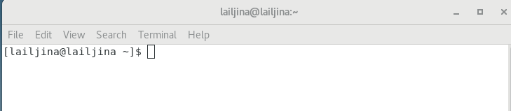

---
## Front matter
title: "Отчёт по лабораторной работе № 4"
subtitle: "Операционные системы"
author: "Ильина Любовь Александровна"

## Generic otions
lang: ru-RU
toc-title: "Содержание"

## Bibliography
bibliography: bib/cite.bib
csl: pandoc/csl/gost-r-7-0-5-2008-numeric.csl

## Pdf output format
toc: true # Table of contents
toc-depth: 2
lof: true # List of figures
lot: true # List of tables
fontsize: 12pt
linestretch: 1.5
papersize: a4
documentclass: scrreprt
## I18n polyglossia
polyglossia-lang:
  name: russian
  options:
	- spelling=modern
	- babelshorthands=true
polyglossia-otherlangs:
  name: english
## I18n babel
babel-lang: russian
babel-otherlangs: english
## Fonts
mainfont: PT Serif
romanfont: PT Serif
sansfont: PT Sans
monofont: PT Mono
mainfontoptions: Ligatures=TeX
romanfontoptions: Ligatures=TeX
sansfontoptions: Ligatures=TeX,Scale=MatchLowercase
monofontoptions: Scale=MatchLowercase,Scale=0.9
## Biblatex
biblatex: true
biblio-style: "gost-numeric"
biblatexoptions:
  - parentracker=true
  - backend=biber
  - hyperref=auto
  - language=auto
  - autolang=other*
  - citestyle=gost-numeric
## Pandoc-crossref LaTeX customization
figureTitle: "Рис."
tableTitle: "Таблица"
listingTitle: "Листинг"
lofTitle: "Список иллюстраций"
lotTitle: "Список таблиц"
lolTitle: "Листинги"
## Misc options
indent: true
header-includes:
  - \usepackage{indentfirst}
  - \usepackage{float} # keep figures where there are in the text
  - \floatplacement{figure}{H} # keep figures where there are in the text
---

# Цель работы
Познакомиться с операционной системой Linux, получить практические навыки рабо-
ты с консолью и некоторыми графическими менеджерами рабочих столов операционной
системы.

# Задание
/home/lailjina/work/study/2022-2023/Операционные системы/os-intro/labs/lab04/report
1. Ознакомиться с теоретическим материалом.
2. Загрузить компьютер.
3. Перейти на текстовую консоль. Сколько текстовых консолей доступно на вашем ком-
пьютере?
4. Перемещаться между текстовыми консолями. Какие комбинации клавиш необходимо
при этом нажимать?
5. Зарегистрироваться в текстовой консоли операционной системы. Какой логин вы при
этом использовали? Какие символы отображаются при вводе пароля?
6. Завершить консольный сеанс. Какую команду или комбинацию клавиш необходимо
для этого использовать?
7. Переключиться на графический интерфейс. Какую комбинацию клавиш для этого
необходимо нажать?
8. Ознакомиться с менеджером рабочих столов. Как называется менеджер, запускаемый
по умолчанию?
9. Поочерёдно зарегистрироваться в разных графических менеджерах рабочих столов
(GNOME, KDE, XFCE) и оконных менеджерах (Openbox). Продемонстрировать разницу
между ними, сделав снимки экрана (скриншоты). Какие графические менеджеры
установлены на вашем компьютере?
10. Изучить список установленных программ. Обратить внимание на предпочтитель-
ные программы для разных применений. Запустите поочерёдно браузер, текстовой
редактор, текстовой процессор, эмулятор консоли. Укажите названия программ.

# Выполнение лабораторной работы

1. Перейдем на текстовую консоль. Увидим, что доступно текстовых консолей. (рис.\@ref(fig:001)).

{#fig1:001}

2. 

# Выводы

Провела ознакомление с операционной системой Linux, получила практические навыки рабо-
ты с консолью и некоторыми графическими менеджерами рабочих столов операционной
системы.
